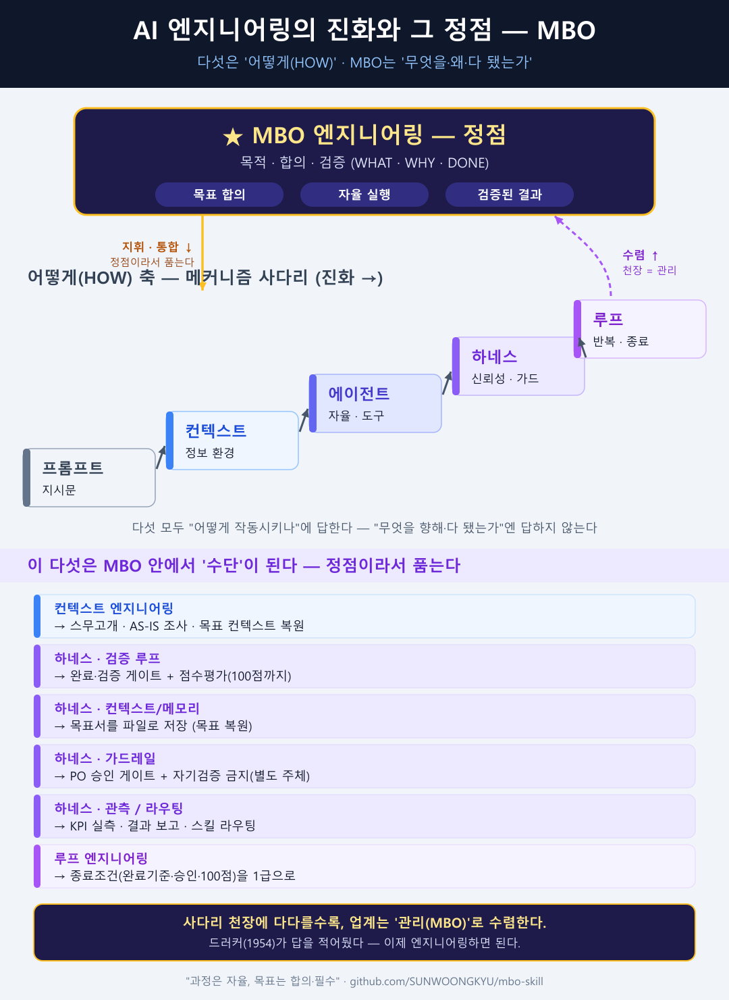
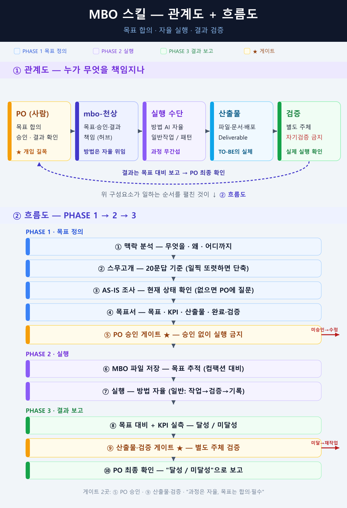

# MBO 엔지니어링: 메커니즘 사다리의 천장에서 만나는 것

나는 작년부터 "MBO 엔지니어링"을 주창해왔다. 계기는 단순한 실패였다. AI에게 62개 작업을 한 번에 시킨 적이 있다. 돌아온 건 빈 껍데기였다. 폴더는 생겼고 파일도 있었다. 그런데 열어보니 함수는 호출되지 않았고, 화면의 버튼은 어디로도 가지 않았다. 형식상 "다 했다"였지만, 실제로는 아무것도 끝나지 않았다. 문제는 AI의 실력이 아니었다. 나는 "무엇을 향해 가는가, 다 됐다는 걸 어떻게 알 것인가"를 한 번도 합의하지 않은 채 일을 던졌을 뿐이다.

지난 몇 년간 AI 엔지니어링은 사다리를 타고 올라왔다. 프롬프트 엔지니어링 → 컨텍스트 엔지니어링 → 에이전트 엔지니어링 → 하네스 엔지니어링 → 루프 엔지니어링으로. 한 칸씩 올라올 때마다 기계를 더 잘 작동시키게 됐다. 그런데 이 다섯은 전부 같은 축, **"어떻게(HOW)" 축**이다. 다섯 중 어느 것도 "무엇을 향해 가는가, 누구와 합의했는가, 다 됐는지 어떻게 아는가(WHAT·WHY·DONE)"에는 답하지 않는다.

그 빈자리가 MBO 엔지니어링이다. 피터 드러커가 1954년에 제시한 '목표에 의한 관리'를 AI 작업에 맞게 도구화한 것이다. **메커니즘 사다리의 천장에 다다를수록, 업계는 자기도 모르게 '관리(management)'로 수렴한다.** 종료조건을 어떻게 정의할지, 누가 합격을 판정할지, 결과를 무엇과 대조할지 — 천장 근처에서 마주치는 질문은 전부 관리의 질문이다. 70여 년 전 경영학이 정리해둔 답을, 우리는 이제야 뒤늦게 끌어오는 셈이다.

## 여섯 번째 칸이 아니다, 정점이다

핵심은 이렇다. MBO 엔지니어링은 사다리의 여섯 번째 칸이 아니다. **정점이라서 그 다섯을 품는다.** 목적이라는 상위 프레임이 서면, 컨텍스트 엔지니어링도 하네스 엔지니어링도 루프 엔지니어링도 사라지지 않는다. 그 목적 아래로 들어와 '수단'으로 정렬된다. 흩어진 다섯 기법이 아니라, 하나의 목표를 향해 줄 세워진 다섯 도구가 되는 것이다.

이건 선언이 아니라 이미 작동하는 구조다. MBO 스킬 안에서 아래 계층들은 각자의 자리를 이미 찾았다.

| 기존 메커니즘 계층 | MBO 아래에서 맡는 역할(수단) |
| --- | --- |
| 프롬프트 엔지니어링 | 목표서의 지시를 정확한 언어로 전달 |
| 컨텍스트 엔지니어링 | AS-IS 조사·자료를 작업 맥락으로 공급 |
| 에이전트 엔지니어링 | 합의된 목표를 자율 실행하는 주체 |
| 하네스 엔지니어링 | 실행을 감싸 안정적으로 굴리는 골격(검증·메모리·가드레일·관측) |
| 루프 엔지니어링 | KPI 미달 시 재시도·수렴시키는 반복 |

다섯은 그대로 살아 있다. 다만 더는 제각각 흩어진 테크닉이 아니라, '무엇을 향해 가는가'라는 한 축 아래 정렬된 수단이다. 목적이 서야 수단의 자리가 정해진다 — MBO 엔지니어링이 정점인 이유다.

## 작동은 세 단계다

- **목표 정의** — 스무고개식 20문답을 기준으로(필요하면 단축), AS-IS를 조사하고, 목표·KPI·산출물·완료검증 기준을 담은 목표서를 만든 뒤 PO 승인을 받는다.
- **실행** — 목표만 합의되면 방법은 AI 자율에 맡긴다.
- **결과 보고** — "했다"가 아니라 "달성/미달성"으로 보고한다. KPI를 실측해 검증 기준과 대조하고, 미달성이면 사유와 후속을 붙인다.

철학은 단순하다. **과정은 자율, 목표는 합의이자 필수.** 완료기준은 "파일이 있다"가 아니라 "실제로 호출·실행된다". 그리고 자기검증은 금지한다 — 합격 판정은 반드시 별도 주체가 한다. 처음의 빈 껍데기 62개는 바로 이 세 가지가 없어서 나온 결과였다.

---

MBO 스킬: [SKILL.md](../SKILL.md) · 저장소 [github.com/SUNWOONGKYU/mbo-skill](https://github.com/SUNWOONGKYU/mbo-skill)
